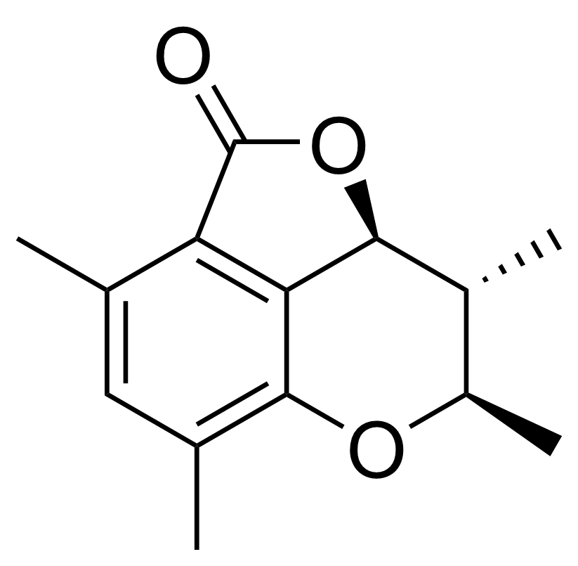
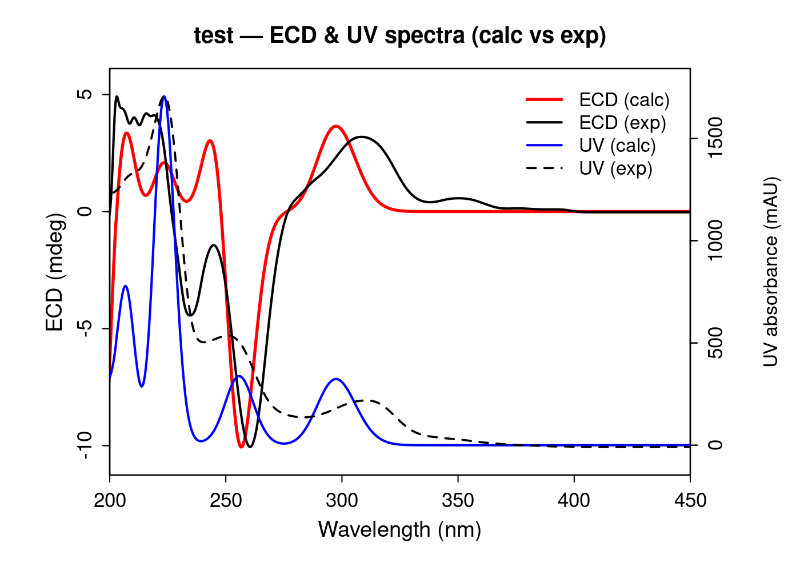

# Create the README.md file for the user to download

content = """# ORCA ECD Workflow for Natural Products

A lightweight and reproducible workflow for conformer generation, filtering, ORCA input preparation, quantum chemical calculation, and ECD/UV post-processing.

Designed for small-molecule ECD calculations using ORCA, with support for batch processing.

---

## Version

v1.0.0 (stable, verified working)

---

## Features

- End-to-end ECD workflow (CREST -> ORCA -> spectrum)
- CREST-based conformer sampling (GFN2-xTB)
- Optional conformer filtering (energy + RMSD)
- ORCA input generation (OPT / FREQ / SP / TDDFT ECD)
- Boltzmann-weighted UV/ECD spectrum generation
- Experimental UV/ECD overlay visualization
- Batch-friendly shell workflow for HPC environments

---

## Workflow

1. Conformer search using CREST
2. Optional conformer filtering when too many conformers are generated (default trigger: >20 conformers)
3. ORCA input generation
4. ORCA calculations (SP + TDDFT ECD)
5. Spectrum extraction and Boltzmann averaging
6. UV/ECD plotting (optional)

---

## Requirements

- Linux (tested on Ubuntu 22.04.5 LTS)
- Bash >= 5.1
- Python >= 3.10
- CREST (tested: 3.0.2)
- ORCA (tested: 6.1.1)

Python packages used in this workflow include:

- numpy
- pandas
- matplotlib
- rdkit

ORCA must be installed and available in PATH.

---

## Repository Structure

```text

.
├── data/
│   └── 20260328_ECD_calculation/
├── docs/
├── .gitignore
├── README.md
├── requirements.txt
└── run_ECD_gold.sh
```

---

## Input

### Structure input (required)

Supported formats:

- .mol2

Used for conformer search and quantum calculations.

### Experimental data (optional)

- UV spectrum: .csv
- ECD spectrum: .csv

Used only for plotting and comparison.

---

## Quick Start

```bash
nohup bash run_ECD_gold.sh \\
  --legacy-input-dir path \\
  --project-name test \\
  > run_ECD.log 2>&1 &


#Monitor progress:

tail -f run_ECD.log
```
---

## Example Output

### Example molecule



### Example UV/ECD overlay



---

## Output

Typical outputs include:

- conf_XXX/ (conformers)
- *.inp (ORCA input)
- *.out (ORCA output)
- *_boltzmann_nm.tsv (spectra)
- *_overlay.png (plots)

---

## Important Notes

### Conformer sampling

- Too many conformers -> high computational cost
- Too few conformers -> inaccurate Boltzmann averaging

Recommended:

- initial energy window: ~20 kcal/mol

Conformer filtering is applied only when the number of generated conformers exceeds the threshold (default: 20).

### UV wavelength shift

Calculated UV spectra may deviate from experimental peak positions.
In some cases, an empirical wavelength shift can be applied for plotting purposes only.

This shift is system-dependent and should not be interpreted as a physical correction.

### ECD interpretation

Use:

- spectral shape
- sign pattern

Do NOT rely on absolute wavelength alignment.

---

## Typical Settings

### CREST

- GFN2-xTB
- methanol

### ORCA

- CAM-B3LYP / PWPB95
- def2-TZVP / def2-QZVPP
- CPCM (SMD)

---

## Applications

- Natural product stereochemistry
- ECD prediction
- Conformer-dependent analysis
- Batch processing

---

## Limitations

- No automatic error recovery
- Depends on conformer quality
- UV may require empirical shift

---

## Design Philosophy

- reproducible
- minimal manual intervention
- modular
- user friendly

---

## License

MIT License

---

## Citation

If used, please cite:

- ORCA (Neese et al.)
- CREST (Grimme et al.)
